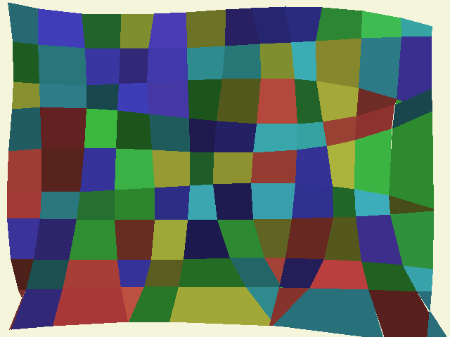

# ipython_notebooks by Terry Spitz

1. [Futoshiki solver](http://nbviewer.jupyter.org/github/terryspitz/ipython_notebooks/blob/master/Futoshiki.ipynb): Solver for Sudoku-like puzzles from http://www.futoshiki.org/ 

2. Functional Images
  
    * [Pan - Functional Images](http://nbviewer.jupyter.org/github/terryspitz/ipython_notebooks/blob/master//Pan%20-%20Functional%20Images.ipynb): A Python version of "A renderer for Functional Images" from  http://web.archive.org/web/20100401011117/http://conal.net/papers/functional-images/fop-conal.pdf 

    * [Checkerball Functional Image](http://nbviewer.jupyter.org/github/terryspitz/ipython_notebooks/blob/master/Checkerball%20Functional%20Image.ipynb): Code golf-ish attempt to generate this image in the shortest number of lines of Python:  
    

    * [Herringbone pattern](http://nbviewer.jupyter.org/github/terryspitz/ipython_notebooks/blob/master/Herringbone.ipynb): make a herringbone tiled pattern.  
    

4. [Temperature](http://nbviewer.jupyter.org/github/terryspitz/ipython_notebooks/blob/master/Temperature.ipynb): My dad went away for Xmas with his heating on the blink, asking me to check the house every day.  What better excuse for an IoT internet connected thermometer!  Based on an ESP8266 and instruction at http://www.instructables.com/id/Temperature-Monitor-with-ESP8266-IoT/.  Took a few hours to build the hardware and IoT site upload of the temperature data.  Took another much more frustrating few hours to upload the single line of Python in this notebook to an Azure site.  

    

5. [Fontvolve](http://nbviewer.jupyter.org/github/terryspitz/ipython_notebooks/blob/master/fontvolve.ipynb): Generic algorithm to evolve a letter outline.  Can you tell what this one is??  

    

6. [deeperfont](http://nbviewer.jupyter.org/github/terryspitz/ipython_notebooks/blob/master/deeperfont.ipynb): Neural Network attempt at the font problem.  Using [Keras](https://keras.io/) and [Tensorflow](https://www.tensorflow.org/), my small network attempts to capture the structure of a set of letters and numbers from a single font.  

    
    

7. [Make-Taeuber-Arp](http://nbviewer.jupyter.org/github/terryspitz/ipython_notebooks/blob/master/Make-Taeuber-Arp.ipynb): An art-generator in the style of Sophie Taeuber-Arp.... inspired by her [Google Doodle](https://www.google.com/doodles/sophie-taeuber-arps-127th-birthday).

    

8. [Caustics Animation in numpy](http://nbviewer.jupyter.org/github/terryspitz/ipython_notebooks/blob/master/Caustic%20Animation.ipynb) Here we attempt to render the effect of light rays refracting through a water surface perturbed by waves.

    
  