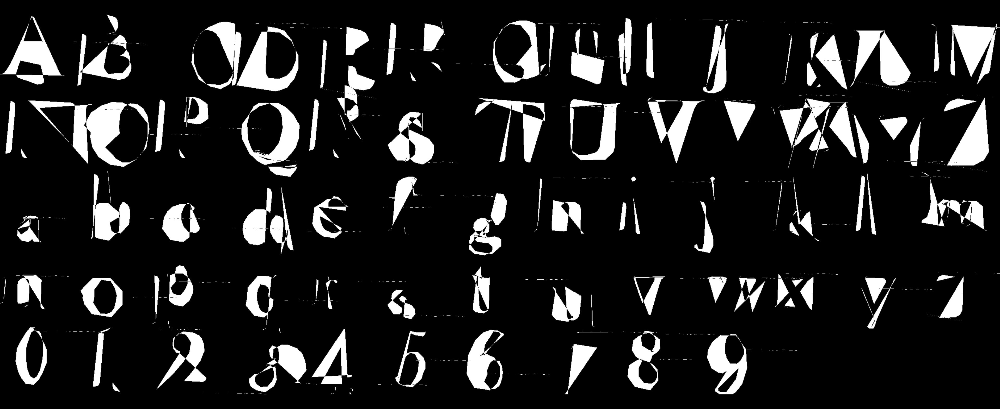
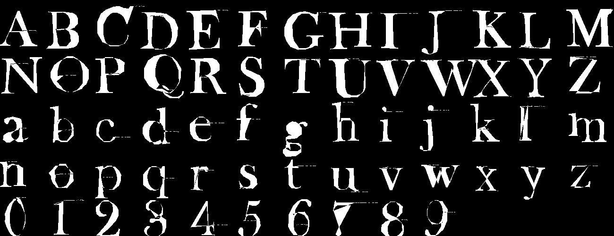
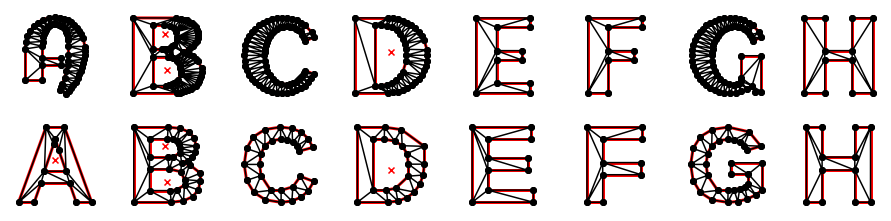
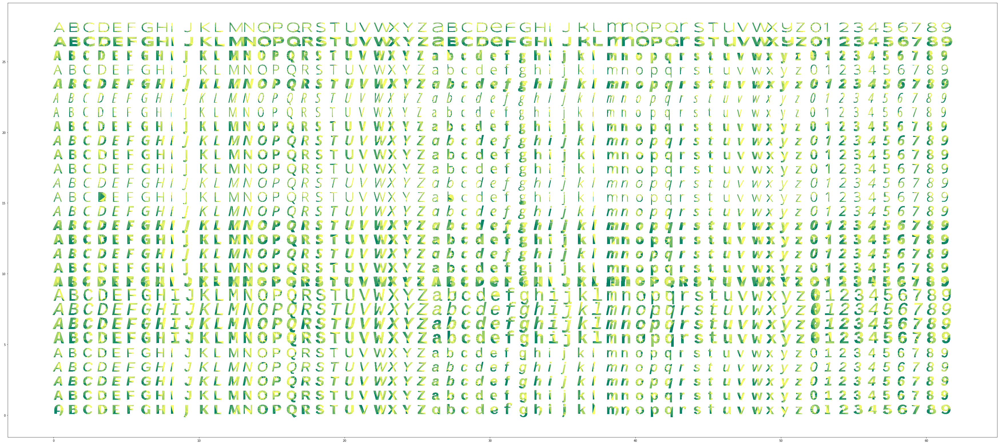

# Deeperfont

Deeperfont is a Neural Network attempt at the 'Font Problem' - that is, how to capture the essence of a font in such a way as to generalise to unseen glyphs and to allow interpolation between different fonts.  This problem was noted as early as 1979 when Donald Knuth wrote the first version of [MetaFont](https://en.wikipedia.org/wiki/Metafont).

For this network initial research suggested the use of [Keras](https://keras.io/) and [Tensorflow](https://www.tensorflow.org/) as best practise for both getting started and long-term research.  The VAE framework consisting of an encoder and decoder seems appropriate for both initial training of a latent vector capturing the underlying variable defining the glyph, then allowing generation of new glyphs by sampling from altered latent variables.

As output the network will generate a set of [glyph outlines](https://en.wikipedia.org/wiki/Glyph).  The encoding of outputs has been considered in a number of ways: 
* raw (x,y) coordinates, for example as expressed in the [TrueType](https://en.wikipedia.org/wiki/TrueType) font file
* incremental coordinate changes (dx,dy)
* a conversion of these outlines to (angle, distance) pairs for each line as in [Turtle graphics](https://en.wikipedia.org/wiki/Turtle_graphics) (best known for its  use in [Logo](https://en.wikipedia.org/wiki/Logo_(programming_language).)  We do not currently model the bezier curves used in the original glyphs; a future enhancement could use a rendered glyph as the source of font coordinates to train against.

Considering the [loss](https://en.wikipedia.org/wiki/Loss_function) or evaluation function we note that the exact sequence of points in the glyph can be varied while generating identical rendered output, for example a line segment can be split into a number of smaller colinear segments.  The network should be free to express its results in any equivalent way.  The evaluation function is therefore required to compare rendered output.  We build an evaluation function in pure Tensorflow using a [scanline algorithm](https://en.wikipedia.org/wiki/Scanline_rendering) to generate a tensor containing the x coordinates of the outline for a set of equi-spaced y line. We use a final lambda layer calling this function to render the outlines.  The predicted and true outlines are then compared by calculating the difference in these coordinates.

We would like access to the trained glyph outlines for which we use a named layer in keras.  Since the loss function using x coordinates is unstable and often NaNs, we plan to train on both the penultimate outlines layer as an auxillary loss with small weight as well as the final x coordinates, using the [keras functional model API with multiple outputs](https://keras.io/getting-started/functional-api-guide/#multi-input-and-multi-output-models).

As input we provide a [one-hot](https://en.wikipedia.org/wiki/One-hot) vector representing the individual glyphs to render.  In a future enhancement where we train against multiple fonts, this input could also include a feature for font family and font classifications such as serif/sans-serif/script/etc which would allow interpolation over these dimensions.

After initial result it became clear that the resulting outlines suffer from a lack of global coordination: while individual sets of edges and curves might closely match the original glyph, the network fails to capture the relationship between the two side of the strokes that we see when a human parses the image, for example the inside and outside edges of an O which look to us like a single circle of fixed or slowly varying width.  In order to encode this dependency more explicitly in the representation, we have replaced a set of points with a [triangulation](deeperfont_tri_data_preparation.ipynb) of the glyph.  To further encode this in a flat sequence for input to the model, we create a [TriangleStack](TriangleStack.py) which consists of a sequence of point and triangle elements. Each element in the sequence consists of a pair of coordinates dx, dy in [0, 1]  and a pair of offsets in the stack for the corners of the triangle v1, v2 where the third vertex v0 is omitted as it is always the current element (v0=0).  The point and triangle vertex offsets are optional to allow multiple triangles built from the current point or a point used in subsequent triangles only.

To reconstruct the outlines:
1. For each element in the sequence: 
    1. If the coordinates dx, dy are present: a point is added to the stack of points P at x, y = dx, dy from previous point.
    1. If the stack offsets v1, v2 are present: draw a triangle with corners at the current point x, y and points v1+1, v2+2 from the end of the stack (this allows the two offsets to range from 0)

This dense representation encodes all points and triangles efficiently which should allow easier training.  Work continues.

## References
1. [MetaFont](https://en.wikipedia.org/wiki/Metafont)
1. [Metaflop - interactive MetaFont](http://www.metaflop.com/modulator)
1. [deepfont](https://erikbern.com/2016/01/21/analyzing-50k-fonts-using-deep-neural-networks.html)
1. https://arxiv.org/abs/1507.03196
1. https://pypi.python.org/pypi/FontTools
1. https://www.arxiv-vanity.com/papers/1809.02257/ Representing Images in 200 Bytes: Compression via Triangulation
1. https://en.wikipedia.org/wiki/B%C3%A9zier_curve#Offsets_(a.k.a._stroking)_of_B%C3%A9zier_curves
1. https://github.com/IShengFang/TypographyResearchCollection?tab=readme-ov-file Overview of papers in the field

